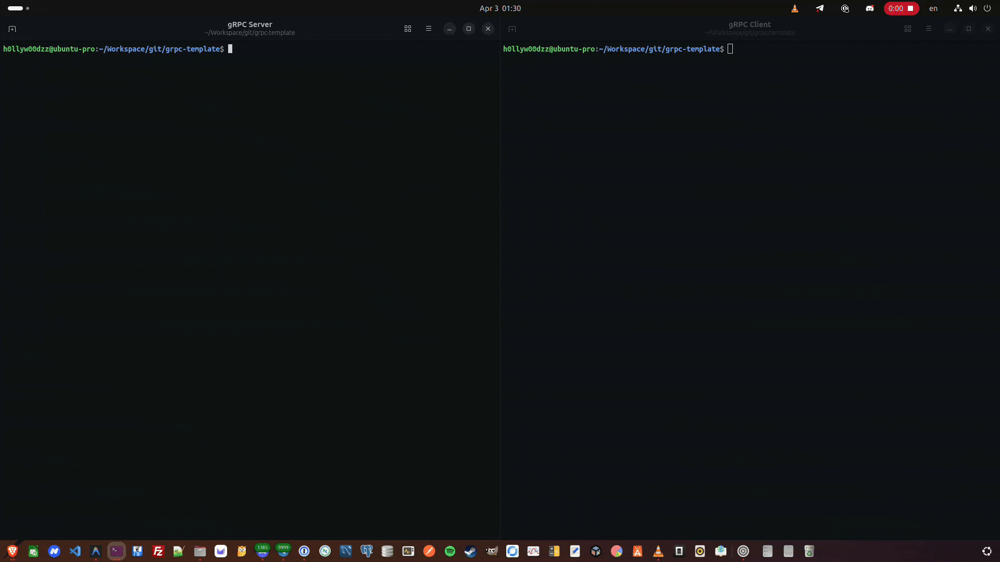
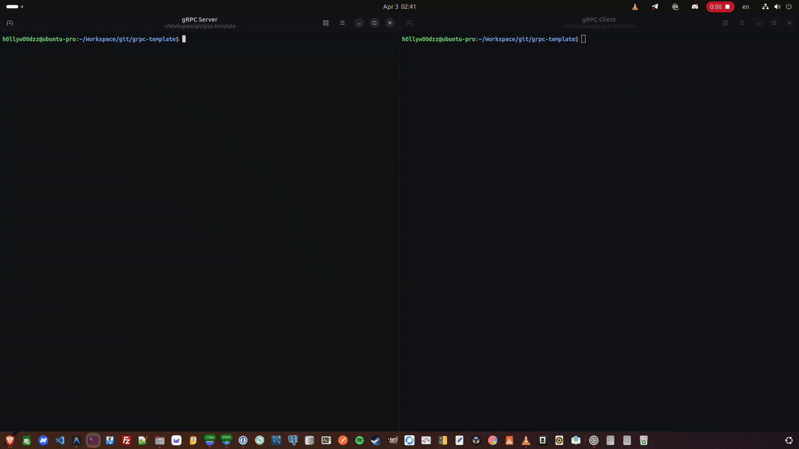

# gRPC Template

[](https://go.dev/dl/)
[](https://pkg.go.dev/github.com/H0llyW00dzZ/grpc-template)
[](https://goreportcard.com/report/github.com/H0llyW00dzZ/grpc-template)
[](https://codecov.io/gh/H0llyW00dzZ/grpc-template)

```text
       ______ ______  _____   _____                        _         _        
       | ___ \| ___ \/  __ \ |_   _|                      | |       | |       
  __ _ | |_/ /| |_/ /| /  \/   | |  ___  _ __ ___   _ __  | |  __ _ | |_  ___ 
 / _` ||    / |  __/ | |       | | / _ \| '_ ` _ \ | '_ \ | | / _` || __|/ _ \
| (_| || |\ \ | |    | \__/\   | ||  __/| | | | | || |_) || || (_| || |_|  __/
 \__, |\_| \_|\_|     \____/   \_/ \___||_| |_| |_|| .__/ |_| \__,_| \__|\___|
  __/ |                                            | |                        
 |___/   by H0llyW00dzZ (@github.com/H0llyW00dzZ)  |_|                        
```

A production-ready Go gRPC template/boilerplate for bootstrapping new gRPC projects. Designed as a template repository for any Git code hosting (e.g., GitHub).

> **Actively maintained** — I built this template from my own experience with high-performance and critical systems that rely on gRPC. Proto definitions are added as I encounter real-world patterns worth templating. Use this repo as a template to bootstrap your next project without writing boilerplate from scratch.

> [!WARNING]
> **Breaking Changes Notice** — This template repository is under active development. Proto definitions, service interfaces, generated code structure, and interceptor APIs may change without prior deprecation. Pin to a specific commit if you need stability.

## Features

- **Proto-first** — [Buf](https://buf.build/) for proto linting and code generation
- **Multi-language** — generates Go server & client stubs, TypeScript/JavaScript, PHP, and C++ client code
- **Functional Options** — clean, extensible configuration for both server and client
- **TLS / mTLS** — secure connections with a single option (server + client)
- **Pluggable Logging** — `logging.Handler` interface (default: `slog`) — swap in zap, zerolog, logrus, or any backend; `logging.Resolve` provides nil-safe fallback to the default handler
- **Built-in Interceptors** — server (recovery, logging, request ID, auth, validation, rate limiting) and client (logging, timeout, retry, auth) interceptor packages for both unary and streaming RPCs — with proxy-aware client IP extraction

> [!TIP]
> **New to gRPC?** Interceptors run *before* a request reaches your service handler — think of them as middleware that operates on the raw RPC layer using Go's native `context.Context`. This makes them more robust than most HTTP frameworks that rely on their own custom context types. Auth, logging, and recovery all happen transparently before your business logic is ever invoked.
- **Health Checks** — standard [gRPC Health Checking Protocol](https://github.com/grpc/grpc/blob/master/doc/health-checking.md) with runtime per-service status via `srv.Health()`
- **Server Reflection** — debug with [grpcurl](https://github.com/fullstorydev/grpcurl) out of the box
- **Graceful Shutdown** — handles `SIGINT`/`SIGTERM` and drains connections
- **Proto Collection** — ready-to-use proto templates for common patterns
- **Example RPCs** — unary, server streaming, client streaming, and bidirectional

## Why gRPC in 2026?

In 2026, gRPC is the clear winner for service-to-service communication — and **especially for AI / AI-tool workloads**:

| | REST / JSON (HTTP/1.1) | gRPC (HTTP/2 + Protobuf) |
|---|---|---|
| **Serialization** | Text-based JSON — parse overhead on every call | Binary Protobuf — 5-10× smaller payloads, near-zero parse cost |
| **Transport** | One request per connection (or clunky keep-alive) | Multiplexed streams over a single HTTP/2 connection |
| **Streaming** | Workarounds (SSE, WebSockets, chunked transfer) | Native bidirectional streaming, first-class support |
| **Latency** | Higher per-call overhead from headers + JSON encoding | Minimal framing; ideal for high-frequency AI inference calls |
| **Code generation** | Manual client SDKs or OpenAPI generators | Strongly-typed stubs generated from `.proto` files for any language |

Modern AI systems — LLM orchestrators, inference pipelines, tool-calling agents (MCP), embedding services — make **thousands of low-latency calls** between components. The overhead of REST/JSON serialization and HTTP/1.1 connection management adds up fast. gRPC eliminates that overhead with binary serialization, persistent multiplexed connections, and native streaming, making it the natural transport layer for AI-native architectures.

## Showcase

The demo below shows the [`cmd/server`](cmd/server) and [`cmd/client`](cmd/client) in action — unary and server-streaming RPCs over gRPC:


With streaming interceptors enabled, both unary and streaming RPCs are logged with method, duration, and error details:


With server reflection enabled, the client discovers all available services at runtime via `ListServices` and logs each fully-qualified service name before invoking RPCs:


With request ID tracing added to the interceptor chain, every unary and streaming RPC is tagged with a unique `request_id` for end-to-end correlation — making it easy to trace individual requests across logs:



With client-side load balancing (`round_robin`) and server-advertised service config, the client distributes RPCs across available backends while the server declares its preferred balancing policy via `WithDefaultServiceConfig`:



<details>
<summary><b>Server configuration</b> — <code>cmd/server/main.go</code></summary>

```go
func main() {
	// Enable debug logging (shows Debug level + reflection calls)
	h := slog.NewTextHandler(os.Stdout, &slog.HandlerOptions{
		Level: slog.LevelDebug,
	})
	slog.SetDefault(slog.New(h))
	// Initialize logger
	l := logging.Default()

	// Create and configure the gRPC server.
	srv := server.New(
		server.WithPort("50051"),
		server.WithReflection(),
		server.WithLogger(l),
		server.WithUnaryInterceptors(
			interceptor.RequestID(),
			interceptor.Recovery(),
			interceptor.Logging(),
		),
		server.WithStreamInterceptors(
			interceptor.StreamRequestID(),
			interceptor.StreamRecovery(),
			interceptor.StreamLogging(),
		),
		server.WithDefaultServiceConfig(`{"loadBalancingConfig":[{"round_robin":{}}]}`),
	)

	// Create the greeter service utilizing the server's integrated logger.
	greeterSvc := greeter.NewService(srv.Logger())

	// Register services.
	srv.RegisterService(greeterSvc.Register)

	// Run the server (blocks until shutdown).
	if err := srv.Run(context.Background()); err != nil {
		log.Fatal(err)
	}
}
```

</details>

<details>
<summary><b>Client configuration</b> — <code>cmd/client/main.go</code></summary>

```go
const (
	defaultAddr = "dns:///localhost:50051"
	defaultName = "World"
)

func main() {
	// Enable debug logging (shows Debug level + reflection calls)
	h := slog.NewTextHandler(os.Stdout, &slog.HandlerOptions{
		Level: slog.LevelDebug,
	})
	slog.SetDefault(slog.New(h))
	// Initialize logger.
	l := logging.Default()

	// Create and configure the gRPC client.
	c := client.New(defaultAddr,
		client.WithInsecure(),
		client.WithLogger(l),
		client.WithDefaultTimeout(5*time.Second),
		client.WithRetry(3, time.Second),
		client.WithUnaryInterceptors(
			clientinterceptor.Logging(),
			clientinterceptor.Timeout(),
			clientinterceptor.Retry(),
		),
		client.WithStreamInterceptors(
			clientinterceptor.StreamLogging(),
		),
		client.WithLoadBalancing("round_robin"),
	)

	// Connect to the server.
	ctx := context.Background()
	if err := c.Connect(ctx); err != nil {
		log.Fatal(err)
	}
	defer c.Close()

	// List available services via runtime reflection.
	services, err := c.ListServices(ctx)
	if err != nil {
		l.Error("ListServices: %v", err)
	} else {
		for _, svc := range services {
			l.Info("available service", "name", svc)
		}
	}

	// Create the greeter caller using the client's connection and logger.
	caller := greeter.NewCaller(c.Conn(), c.Logger())

	// --- Unary RPC ---
	reply, err := caller.SayHello(ctx, defaultName)
	if err != nil {
		log.Fatalf("SayHello failed: %v", err)
	}
	l.Info("SayHello response", "message", reply.GetMessage())

	// --- Server Streaming RPC ---
	stream, err := caller.SayHelloServerStream(ctx, defaultName)
	if err != nil {
		log.Fatalf("SayHelloServerStream failed: %v", err)
	}

	for {
		reply, err := stream.Recv()
		if err == io.EOF {
			break
		}
		if err != nil {
			log.Fatalf("stream recv failed: %v", err)
		}
		l.Info("stream response", "message", reply.GetMessage())
	}

	l.Info("client demo completed")
}
```

</details>

## Project Structure

```text
grpc-template/
├── cmd/
│   ├── server/main.go          # Server entry point
│   └── client/main.go          # Client demo
├── deploy/                     # Deployment templates
│   └── kubernetes/             # Kustomize manifests (Deployment, HPA, NetworkPolicy, PDB, Service)
├── internal/
│   ├── logging/                # Pluggable logger (logging.Handler interface, slog default)
│   ├── client/                 # High-level gRPC client with lifecycle management and interceptors
│   │   ├── client.go           # Client connection, health watching, and lifecycle
│   │   ├── option.go           # Functional options (TLS, timeout, retry, interceptors)
│   │   └── interceptor/        # Client-side interceptors (logging, timeout, retry, auth)
│   ├── server/                 # gRPC server lifecycle
│   │   ├── server.go           # Server with graceful shutdown
│   │   ├── option.go           # Functional options (TLS, mTLS)
│   │   └── interceptor/        # Modular interceptors (logging, recovery, auth, request ID, validation, rate limiting)
│   ├── service/
│   │   └── greeter/            # Example service implementation
│   │       ├── greeter.go      # Greeter service (server-side handler)
│   │       ├── caller.go       # Greeter caller (client-side typed wrapper)
│   │       └── greeter_test.go # Greeter service tests
│   └── testutil/
│       └── grpctest.go         # Shared bufconn test helpers
├── proto/
│   ├── analytics/v1/           # Event tracking & aggregation
│   ├── audit/v1/               # Audit logging & compliance
│   ├── auth/v1/                # Multi-credential auth
│   ├── config/v1/              # Remote config & feature flags
│   ├── crud/v1/                # CRUD with pagination & field masks
│   ├── discovery/v1/           # Service registry & discovery
│   ├── echo/v1/                # All 4 RPC patterns
│   ├── geo/v1/                 # Geospatial operations
│   ├── helloworld/v1/          # GreeterService (unary + server streaming)
│   ├── identity/v1/            # User management & RBAC
│   ├── kv/v1/                  # Key-value store with watch
│   ├── media/v1/               # Media processing pipelines
│   ├── messaging/v1/           # Real-time messaging / pub-sub
│   ├── nawala/v1/              # DNS-based domain blocking detection (Nawala/Komdigi)
│   ├── shoutbox/v1/            # Classic forum shoutbox (real-time)
│   ├── notification/v1/        # Push notifications & events
│   ├── queue/v1/               # Message queue with DLQ
│   ├── ratelimit/v1/           # Rate limiting & quota enforcement
│   ├── scheduler/v1/           # Cron / scheduled job management
│   ├── search/v1/              # Full-text search & indexing
│   ├── secret/v1/              # Vault / secret management
│   ├── s3/v1/                  # Full S3-compatible storage (buckets, presigned URLs)
│   ├── storage/v1/             # Generic object storage (any backend)
│   ├── task/v1/                # Async job queue with progress
│   └── workflow/v1/            # State machine / orchestration
├── pkg/gen/                    # Generated Go code (do not edit)
├── pkg/gen-ts/                 # Generated TypeScript/JS code (do not edit)
├── pkg/gen-php/                # Generated PHP code (do not edit)
├── pkg/gen-cpp/                # Generated C/C++ protobuf (client only)
├── .dockerignore               # Excludes .git, bin/, deploy/ from Docker context
├── Dockerfile                  # Multi-stage build (Go 1.26 + Alpine)
├── buf.yaml                    # Buf module config
├── buf.gen.yaml                # Buf generation config
├── Makefile                    # Build automation
└── README.md
```

## Getting Started

Clone this repository to bootstrap your new project:

```bash
git clone https://github.com/H0llyW00dzZ/grpc-template.git my-grpc-project
cd my-grpc-project
```

Then run `make init` to wire up the module path, reset git history, and get a clean starting point:

```bash
# Auto-derives <git-host>/<your-git-username>/my-grpc-project
# Host is detected from `git remote get-url origin` — works with GitHub, GitLab, Gitea, Bitbucket, etc.
make init DIR=.

# Or point it at a new directory — the template is copied there first
make init DIR=../my-grpc-project

# Override the full module path explicitly (bypasses all auto-detection)
make init MODULE=github.com/yourorg/yourproject
make init MODULE=gitlab.com/yourorg/yourproject
make init MODULE=gitea.example.com/yourorg/yourproject
```

`make init` will:
1. Detect the git host from `git remote get-url origin` (HTTPS or SSH) — falls back to `github.com` if no remote is set
2. Read `git config user.name` and the project directory name to build the Go module path
3. Rewrite the module path across all `.go`, `.proto`, and `.yaml` files
4. Update `go.mod` and run `go mod tidy`
5. Wipe the template git history and create a fresh initial commit


## Prerequisites

- [Go](https://go.dev/) 1.26+
- [Buf CLI](https://buf.build/docs/installation)

Install tools:

```bash
make deps
```

## Quick Start

### 1. Generate proto code

```bash
make proto
```

### 2. Run the server

```bash
make run-server
```

### 3. Run the client (in another terminal)

```bash
make run-client
```

## Proto Collection

This template ships with ready-to-use proto definitions so you never have to write them from scratch:

| Proto | Package | What It Covers |
|-------|---------|----------------|
| [`helloworld/v1`](proto/helloworld/v1/helloworld.proto) | GreeterService | Unary + server-streaming RPCs |
| [`echo/v1`](proto/echo/v1/echo.proto) | EchoService | All 4 RPC patterns (unary, server stream, client stream, bidirectional) |
| [`crud/v1`](proto/crud/v1/crud.proto) | CrudService | Create, Get, List (pagination), Update (field mask), Delete |
| [`auth/v1`](proto/auth/v1/auth.proto) | AuthService | Multi-credential login (`oneof`: password, API key, OAuth), refresh, validate, logout |
| [`messaging/v1`](proto/messaging/v1/messaging.proto) | MessagingService | Send, subscribe (server stream), full-duplex streaming, channels, metadata |
| [`nawala/v1`](proto/nawala/v1/nawala.proto) | NawalaCheckerService | DNS-based domain blocking detection (single, batch, bidirectional stream), DNS health, server management, cache flush |
| [`shoutbox/v1`](proto/shoutbox/v1/shoutbox.proto) | ShoutboxService | Classic forum shoutbox with moderation (PostShout, WatchShouts, DeleteShout, ClearShoutbox) |
| [`storage/v1`](proto/storage/v1/storage.proto) | StorageService | Chunked upload (client stream), download (server stream), object info, list |
| [`task/v1`](proto/task/v1/task.proto) | TaskService | Submit, status, watch (server stream for progress), cancel, list with filters |
| [`notification/v1`](proto/notification/v1/notification.proto) | NotificationService | Send to recipients/topics, subscribe (server stream), acknowledge, list |
| [`kv/v1`](proto/kv/v1/kv.proto) | KvService | Get, set (TTL), delete, batch ops, watch (server stream), optimistic locking |
| [`discovery/v1`](proto/discovery/v1/discovery.proto) | DiscoveryService | Register, deregister, lookup, heartbeat, watch topology changes |
| [`ratelimit/v1`](proto/ratelimit/v1/ratelimit.proto) | RateLimitService | Check (allow/deny/throttle), report usage, get quota, manage rules |
| [`config/v1`](proto/config/v1/config.proto) | ConfigService | Get/set/delete config, watch changes, feature flag evaluation |
| [`audit/v1`](proto/audit/v1/audit.proto) | AuditService | Log events (single/batch), query with filters, stream real-time audit trail |
| [`scheduler/v1`](proto/scheduler/v1/scheduler.proto) | SchedulerService | Create/update/delete schedules, pause/resume, cron expressions, execution history |
| [`search/v1`](proto/search/v1/search.proto) | SearchService | Index, search (facets/filters/sort), suggest (autocomplete), batch index |
| [`workflow/v1`](proto/workflow/v1/workflow.proto) | WorkflowService | Start, signal, query, cancel, list, watch state transitions |
| [`geo/v1`](proto/geo/v1/geo.proto) | GeoService | Nearby search, geocode, reverse geocode, geofencing, route, location tracking |
| [`media/v1`](proto/media/v1/media.proto) | MediaService | Transcode, resize, job status, watch progress (server stream), cancel |
| [`secret/v1`](proto/secret/v1/secret.proto) | SecretService | Get/put/delete secrets, version history, rotation, watch rotation events |
| [`s3/v1`](proto/s3/v1/s3.proto) | S3Service | Bucket CRUD, object ops, presigned URLs for any S3-compatible server |
| [`identity/v1`](proto/identity/v1/identity.proto) | IdentityService | User CRUD, assign/revoke roles, check permissions (RBAC) |
| [`analytics/v1`](proto/analytics/v1/analytics.proto) | AnalyticsService | Track events (single + client stream batch), aggregation queries, reports |
| [`queue/v1`](proto/queue/v1/queue.proto) | QueueService | Publish, consume (server stream), ack/nack, DLQ, visibility timeout |

Pick what you need, delete what you don't. Each proto is self-contained under `proto/<service>/v1/`.

## Testing

Tests use [bufconn](https://pkg.go.dev/google.golang.org/grpc/test/bufconn) for in-memory gRPC connections — no TCP ports needed, fast and hermetic.

```bash
make test
```

Shared test helpers live in `internal/testutil/`. See `internal/service/greeter/greeter_test.go` for a working example of unary and server-streaming RPC tests.

## Benchmarks

The template ships with comprehensive benchmarks covering interceptors, logging, and service handlers:

```bash
# Run all benchmarks
make bench

# Run only specific benchmarks
make bench BENCH_FILTER=GetConfig
make bench BENCH_FILTER=SayHello
```

Benchmarks are organized by package:
- **Server interceptors** — recovery, logging, auth, rate limiting, peer key extraction (`internal/server/interceptor/`)
- **Client interceptors** — logging, auth, retry, timeout, backoff (`internal/client/interceptor/`)
- **Logging** — atomic default logger operations (`internal/logging/`)
- **Greeter service** — end-to-end unary, parallel, and streaming RPCs over bufconn (`internal/service/greeter/`)

Benchmarks run in CI on every push/PR across all matrix OS/Go-version combinations.

## Using the Client

The `internal/client` package provides a high-level client with functional options, automatic interceptor configuration, service discovery, health watching, and graceful lifecycle management.

See `internal/client/doc.go` and `cmd/client/main.go` for usage examples. Key options include:

- `client.WithInsecure()` (also clears any prior TLS config error) / `client.WithTLS()` / `client.WithMutualTLS()` (TLS errors are deferred and returned from `Connect()`)
- `client.WithLogger()`, `client.WithDefaultTimeout()`, `client.WithRetry()`
- `client.WithUnaryInterceptors()` and `client.WithStreamInterceptors()`
- `client.WithHealthWatch()` for background health monitoring with automatic reconnect
- `client.WithTokenSource()` for auth (supports `StaticToken` and `OAuth2TokenSource`)

The client automatically configures shared interceptors via `clientinterceptor.Configure()` when options are used.

After connecting, use `c.ListServices(ctx)` to discover available services at runtime via gRPC reflection (requires `server.WithReflection()` on the server side).

## Adding a New Service

1. **Define a proto** — Create a new `.proto` file under `proto/yourservice/v1/`
2. **Generate code** — Run `make proto`
3. **Implement the service** — Create a new package in `internal/service/<yourservice>/` implementing the generated server interface
4. **Register the service** — Add to `srv.RegisterService(...)` in `cmd/server/main.go`

```go
// In cmd/server/main.go
yourSvc := yourservice.NewService(srv.Logger()) // Use the server's logger!

srv.RegisterService(
    greeterSvc.Register,
    authSvc.Register,
    yourSvc.Register,
)
```

## Customization

### Server

| What | Where | How |
|------|-------|-----|
| Server port | `cmd/server/main.go` | `server.WithPort("8080")` |
| Enable TLS | `cmd/server/main.go` | `server.WithTLS("cert.pem", "key.pem")` (errors deferred to `Run()`) |
| Enable mTLS | `cmd/server/main.go` | `server.WithMutualTLS("cert.pem", "key.pem", "ca.pem")` (errors deferred to `Run()`) |
| Custom logger | `cmd/server/main.go` | `server.WithLogger(myHandler)` — auto-syncs to `interceptor.Configure()` |
| Unary interceptors | `cmd/server/main.go` | `server.WithUnaryInterceptors(interceptor.Recovery(), interceptor.Logging(), ...)` |
| Stream interceptors | `cmd/server/main.go` | `server.WithStreamInterceptors(interceptor.StreamRecovery(), interceptor.StreamLogging(), ...)` |
| Request ID tracing | `cmd/server/main.go` | `interceptor.RequestID()` / `interceptor.StreamRequestID()` |
| Auth / token validation | `cmd/server/main.go` | `server.WithAuthFunc(fn)` + `server.WithExcludedMethods(...)` |
| Request validation | `cmd/server/main.go` | `interceptor.Validation()` (works with `protoc-gen-validate`) |
| Rate limiting | `cmd/server/main.go` | `server.WithRateLimit(100, 200)` (or `interceptor.WithRateLimiter(custom)` for Redis) + `interceptor.RateLimit()` / `interceptor.StreamRateLimit()` |
| Trust proxy headers | `cmd/server/main.go` | `server.WithTrustProxy(true)` — use X-Forwarded-For / X-Real-IP for client IP (only behind trusted proxies) |
| Enable reflection | `cmd/server/main.go` | `server.WithReflection()` |
| Demote cancel logs | `cmd/server/main.go` | `server.WithDemotedMethods("/myapp.v1.LongPoll/Watch")` — demote Canceled errors to Debug; reflection methods demoted by default |
| Set keepalives | `cmd/server/main.go` | `server.WithKeepalive(...)` |
| Set max msg size | `cmd/server/main.go` | `server.WithMaxMsgSize(1024 * 1024 * 50)` |
| Stream limits | `cmd/server/main.go` | `server.WithMaxConcurrentStreams(1000)` |
| Custom listener | `cmd/server/main.go` | `server.WithListener(lis)` |
| Default service config | `cmd/server/main.go` | `server.WithDefaultServiceConfig(json)` — advertise LB policy / service config to clients via name resolvers |
| Raw gRPC options | `cmd/server/main.go` | `server.WithGrpcOptions(opts...)` — pass-through any `grpc.ServerOption` |
| Health status | runtime | `srv.Health().SetServingStatus(svc, status)` — toggle per-service health at runtime |

### Client

| What | Where | How |
|------|-------|-----|
| Target address | `cmd/client/main.go` | `client.New("localhost:50051", ...)` |
| TLS / mTLS | `cmd/client/main.go` | `client.WithTLS(...)`, `client.WithMutualTLS(...)` (errors deferred to `Connect()`) |
| Custom logger | `cmd/client/main.go` | `client.WithLogger(l)` — auto-syncs to `clientinterceptor.Configure()` |
| Timeouts & Retry | `cmd/client/main.go` | `client.WithDefaultTimeout()`, `client.WithRetry(3, time.Second)` |
| Unary interceptors | `cmd/client/main.go` | `client.WithUnaryInterceptors(clientinterceptor.Logging(), clientinterceptor.Timeout(), ...)` |
| Stream interceptors | `cmd/client/main.go` | `client.WithStreamInterceptors(clientinterceptor.StreamLogging(), ...)` |
| Health watching | `cmd/client/main.go` | `client.WithHealthWatch()` — auto-reconnects with exponential backoff |
| Retry codes | `cmd/client/main.go` | `client.WithRetryCodes(codes.Unavailable, codes.ResourceExhausted)` — override default retryable codes |
| Keepalive | `cmd/client/main.go` | `client.WithKeepalive(params)` — keep long-lived connections alive through proxies |
| Max message size | `cmd/client/main.go` | `client.WithMaxMsgSize(maxBytes)` — override default 4 MB limit |
| Raw dial options | `cmd/client/main.go` | `client.WithDialOptions(opts...)` — pass-through any `grpc.DialOption` |
| Auth / Bearer token | `cmd/client/main.go` | `client.WithTokenSource(clientinterceptor.StaticToken("..."))` or `clientinterceptor.OAuth2TokenSource(oauth2.TokenSource)` (from `golang.org/x/oauth2`) |
| Load balancing | `cmd/client/main.go` | `client.WithLoadBalancing(policy)` — client-side LB (`pick_first`, `round_robin`, `weighted_round_robin`, `least_request_experimental`, `ring_hash_experimental`); use `dns:///` target prefix for multi-endpoint resolution |
| Service discovery | runtime | `c.ListServices(ctx)` — query available services via gRPC reflection (requires `server.WithReflection()`) |
| Connection state | runtime | `c.State()` — returns current [connectivity.State]; `c.WaitReady(ctx)` — blocks until Ready |

### Project

| What | Where | How |
|------|-------|-----|
| Proto output path | `buf.gen.yaml` | Change `out` field |
| Go module path | `go.mod` | `go mod edit -module your/module` |

## Make Targets

| Target | Description |
|--------|-------------|
| `make init DIR=../my-project` | Bootstrap a new project: auto-detects git host + username, resets git history |
| `make init MODULE=github.com/org/proj` | Bootstrap with an explicit module path override |
| `make init SIGNED=1 DIR=../my-project` | Bootstrap with a GPG/SSH signed initial commit |
| `make proto` | Generate Go + TypeScript/JS + PHP + C++ code from proto files |
| `make proto-path PROTO_PATH=proto/storage/v1` | Generate code for a specific proto package |
| `make build` | Build server and client binaries |
| `make run-server` | Run the gRPC server |
| `make run-client` | Run the client demo |
| `make test` | Run all tests with race detector |
| `make test-cover` | Run tests with coverage (atomic + race, generates coverage.txt) |
| `make bench` | Run all benchmarks with `-benchmem` |
| `make bench BENCH_FILTER=GetConfig` | Run only matching benchmarks |
| `make vet` | Run `go vet` |
| `make lint` | Run `golangci-lint` |
| `make lint-proto` | Lint proto files with `buf lint` |
| `make gocyclo` | Cyclomatic complexity check (threshold 14) |
| `make gocyclo CYCLO_THRESHOLD=15` | Custom complexity threshold |
| `make clean` | Remove binaries and generated code (Go + TS + PHP + C++) |
| `make deps` | Install required tools (buf, protoc-gen-go, golangci-lint, gocyclo) |
| `make deps-cpp` | Install system packages for C++ protobuf/gRPC code generation |

## Deployment

### Docker

Build the container (use your project name to match the Kubernetes manifests):
```bash
# Replace with your project name — must match the image in deploy/kubernetes/deployment.yaml
docker build -t <your-project-name>:latest .
```

### Deploy Templates

Production-ready deployment templates are available in [`deploy/`](deploy/). See the [deployment guide](deploy/README.md) for available platforms and usage instructions.

## Limitations

gRPC uses HTTP/2 with binary framing, which means **browsers cannot call gRPC services directly** — unlike REST/JSON over HTTP/1.1. If you need browser clients, consider one of these approaches:

| Approach | Description |
|----------|-------------|
| [gRPC-Web](https://github.com/grpc/grpc-web) | A proxy (e.g., Envoy) translates browser-compatible requests to native gRPC |
| [Connect](https://connectrpc.com/) | A protocol that speaks gRPC, gRPC-Web, *and* plain HTTP/JSON — works in browsers natively |
| REST gateway | Use [grpc-gateway](https://github.com/grpc-ecosystem/grpc-gateway) to expose a JSON/REST API alongside gRPC |

> [!NOTE]
> If your architecture is purely backend and you are looking for high performance — service-to-service communication, microservices, AI inference pipelines, CLI tools, or mobile clients — gRPC is the suitable choice. Its binary serialization, multiplexed streams, and native code generation deliver significantly lower latency and higher throughput than REST/JSON.

## License

BSD 3-Clause License — see [LICENSE](LICENSE) for details.
